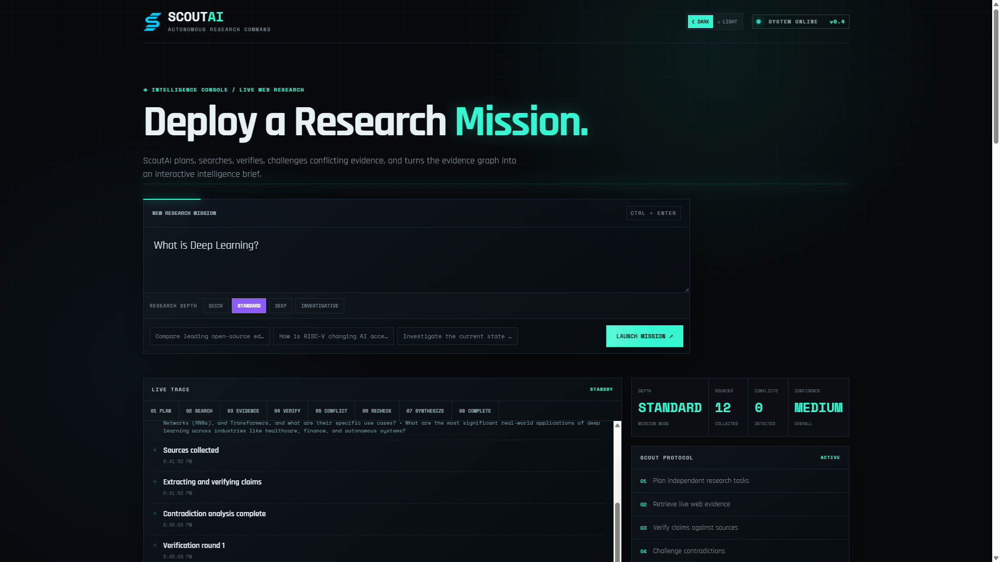
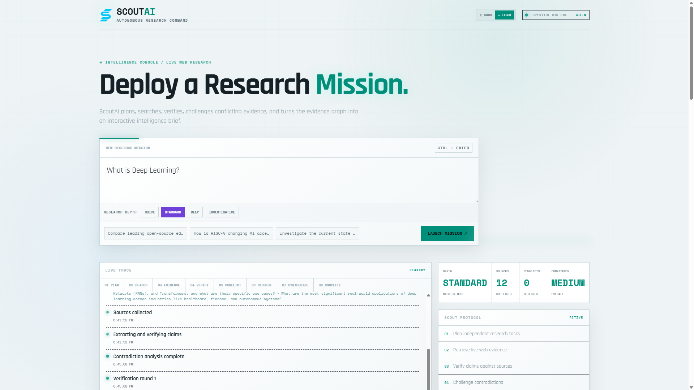
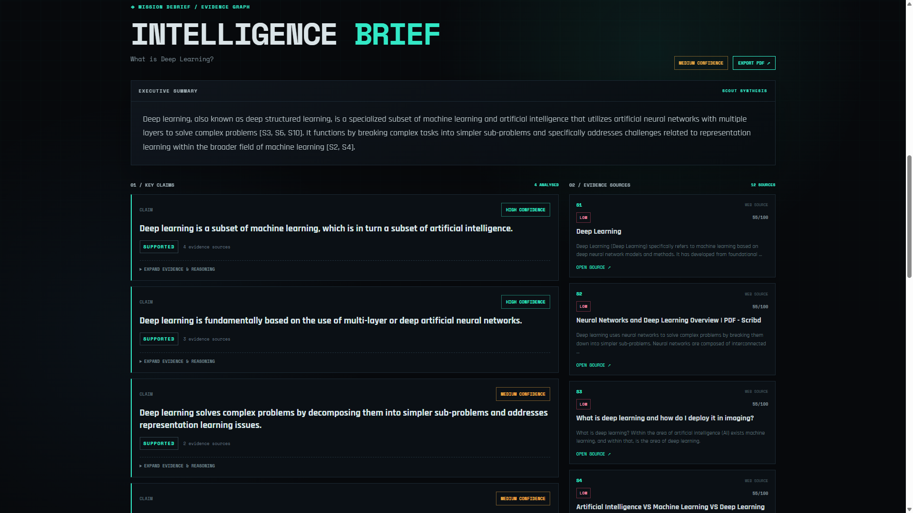
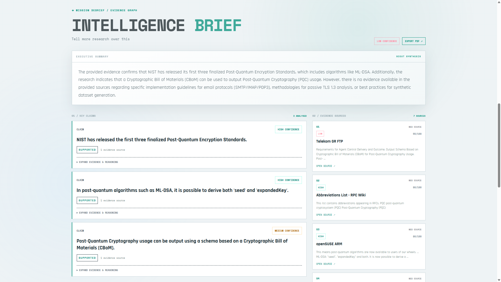

# ScoutAI — Autonomous Research & Intelligence Agent

ScoutAI is an autonomous research system that turns a broad question into a structured, evidence-backed research report.

Instead of relying on a single model response, ScoutAI follows a research loop:

```text
Plan → Search → Verify → Challenge → Synthesize
```

It combines Gemma for reasoning and synthesis with SerpApi for live web retrieval, then exposes the research process through a FastAPI backend and a responsive Next.js console.

## Screenshots

### Research Console — Dark


### Research Console — Light


### Intelligence Brief — Dark


### Intelligence Brief — Light


## Features

- **Autonomous research planning** — breaks a question into searchable research tasks.
- **Live web retrieval** — uses SerpApi to gather current web evidence.
- **Evidence collection** — normalizes sources and extracts claim-supporting evidence.
- **Verification rounds** — revisits unresolved claims and evidence gaps.
- **Contradiction detection** — identifies conflicting evidence instead of silently merging it.
- **Follow-up research** — generates additional searches when the first evidence set is insufficient.
- **Gemma synthesis** — produces the final structured research report from the collected evidence.
- **Adaptive research depth** — choose Quick, Standard, Deep, or Investigative research.
- **Source quality signals** — surfaces transparent heuristic quality metadata for sources.
- **Live research trace** — streams planning, search, verification, contradiction, follow-up, and synthesis events through SSE.
- **Responsive web console** — desktop and phone layouts with light/dark theme support.
- **Multimodal attachments** — attach PDFs, Word documents, spreadsheets, presentations, text files, and images as research context.
- **Visual evidence analysis** — Gemma 4 analyzes attached images for readable text, diagrams, charts, tables, quantities, and visual relationships before research synthesis.
- **API + web UI** — the research engine can be used independently of the frontend.

## Architecture

```text
                         ┌─────────────────────┐
                         │       User          │
                         └──────────┬──────────┘
                                    │
                                    ▼
                         ┌─────────────────────┐
                         │ Next.js Web Console  │
                         │ Desktop + Mobile    │
                         └──────────┬──────────┘
                                    │
                                    ▼
                         ┌─────────────────────┐
                         │   FastAPI Backend   │
                         └──────────┬──────────┘
                                    │
                  ┌─────────────────┼─────────────────┐
                  ▼                 ▼                 ▼
          ┌──────────────┐  ┌──────────────┐  ┌──────────────┐
          │ Gemma        │  │   SerpApi    │  │ Verification │
          │ Planning +   │  │ Live Search  │  │ + Evidence   │
          │ Synthesis    │  │              │  │ Pipeline     │
          └──────────────┘  └──────────────┘  └──────────────┘
                                    │
                                    ▼
                         ┌─────────────────────┐
                         │ Cited Research      │
                         │ Report + Trace      │
                         └─────────────────────┘
```

## Tech Stack

### Backend

- Python
- FastAPI
- Google GenAI SDK
- Gemma
- SerpApi
- Pydantic
- python-dotenv
- FAISS / NumPy scaffolding for future retrieval and memory work
- Pytest
- HTTPX

### Frontend

- Next.js 16
- React 19
- JavaScript
- Responsive CSS
- Server-Sent Events (SSE)

### Deployment

```text
GitHub
   │
   ├──► Vercel
   │      └── Next.js frontend
   │
   └──► Render
          └── FastAPI backend
                 ├── SerpApi
                 └── Google AI Studio / Gemma
```

## Project Structure

```text
ScoutAI/
├── app/
│   ├── agents/
│   │   └── research_agent.py
│   ├── api/
│   │   ├── models.py
│   │   └── routes.py
│   ├── research/
│   │   ├── events.py
│   │   ├── evidence.py
│   │   ├── verifier.py
│   │   └── attachments.py
│   └── main.py
│
├── config/
│   └── settings.py
│
├── data/
│
├── frontend/
│   ├── app/
│   │   ├── page.js
│   │   └── globals.css
│   ├── package.json
│   ├── next.config.mjs
│   └── README.md
│
├── scripts/
├── tests/
├── .env.example
├── render.yaml
├── requirements.txt
├── pyproject.toml
└── README.md
```

## Research Depth

ScoutAI supports four research profiles:

| Mode | Search tasks | Source cap | Verification rounds | Follow-up queries |
|---|---:|---:|---:|---:|
| **Quick** | 3 | 7 | 1 | 2 |
| **Standard** | 5 | 12 | 2 | 4 |
| **Deep** | 7 | 18 | 3 | 5 |
| **Investigative** | 9 | 24 | 4 | 7 |

The agent can stop verification early when there are no unresolved claims or contradictions requiring additional research.

## Source Quality

Each normalized source receives transparent heuristic metadata based on signals such as:

- institutional or authoritative domains
- primary-source indicators
- technical/documentation indicators
- known publisher signals
- URL/domain characteristics

The quality signal is displayed alongside the source in the console. It is a heuristic and does **not** replace evidence-based claim verification.

## API

### Health

```http
GET /health
```

Expected response:

```json
{"status":"ok"}
```

### Research

```http
POST /api/research
Content-Type: application/json

{
  "question": "Your research question",
  "depth": "standard"
}
```

Supported depth values:

```text
quick
standard
deep
investigative
```

### Research with Attachments

The research endpoints accept multipart form data when attachments are included.

Supported attachment types:

```text
PDF, DOC/DOCX, XLS/XLSX, PPT/PPTX, CSV, TXT, Markdown, PNG, JPG/JPEG, WEBP
```

Text-based files are extracted locally before entering the research workflow. Images are analyzed by the configured multimodal Gemma model and their visual findings are added to the research context.

### Streaming Research

```http
POST /api/research/stream
Content-Type: application/json

{
  "question": "Your research question",
  "depth": "standard"
}
```

The streaming endpoint sends Server-Sent Events while the research runs.

Typical event progression:

```text
planning
  ↓
planning_complete
  ↓
searching
  ↓
sources_found
  ↓
verifying
  ↓
contradictions
  ↓
followup_search
  ↓
synthesizing
  ↓
complete
```

## Local Setup

### 1. Clone the repository

```powershell
git clone https://github.com/Barnona/ScoutAI.git
cd ScoutAI
```

### 2. Create and activate a Python environment

```powershell
python -m venv .venv
.\.venv\Scripts\Activate.ps1
```

### 3. Install backend dependencies

```powershell
pip install -r requirements.txt
```

### 4. Configure environment variables

Create `.env` from the example:

```powershell
Copy-Item .env.example .env
```

Set:

```env
GEMINI_API_KEY=your_google_ai_studio_key
GEMMA_MODEL=gemma-4-31b-it
GEMMA_FALLBACK_MODEL=gemma-4-26b-a4b-it
SERPAPI_API_KEY=your_serpapi_key
```

Optional research budget variables are available through the backend configuration.

**Never commit `.env` or API keys.**

## Run the Backend

Start the FastAPI development server:

```powershell
uvicorn app.main:app --reload
```

Backend:

```text
http://127.0.0.1:8000
```

API documentation:

```text
http://127.0.0.1:8000/docs
```

You can also run the research agent directly:

```powershell
python -m scripts.run_agent
```

## Run the Frontend

Open a second terminal:

```powershell
cd frontend
npm install
npm run dev
```

Open:

```text
http://localhost:3000
```

By default, the frontend expects the backend at:

```text
http://localhost:8000
```

To change it, create `frontend/.env.local`:

```env
NEXT_PUBLIC_API_URL=http://localhost:8000
```

## Deployment

### Backend — Render

The repository contains `render.yaml` for the FastAPI service.

Render runs:

```text
pip install -r requirements.txt
uvicorn app.main:app --host 0.0.0.0 --port $PORT
```

Required environment variables:

```text
GEMINI_API_KEY
SERPAPI_API_KEY
GEMMA_MODEL
GEMMA_FALLBACK_MODEL
FRONTEND_ORIGINS
```

Set `FRONTEND_ORIGINS` to the deployed Vercel URL, for example:

```text
https://your-scoutai.vercel.app
```

### Frontend — Vercel

Deploy the repository to Vercel with:

```text
Root Directory: frontend
Framework Preset: Next.js
Build Command: npm run build
Install Command: npm install
```

Set:

```text
NEXT_PUBLIC_API_URL=https://YOUR-RENDER-SERVICE.onrender.com
```

The API URL should be the **base Render URL**, not `/api/research`.

After changing `NEXT_PUBLIC_API_URL`, redeploy the Vercel project.

## Troubleshooting

### Frontend reports HTTP 404

Check:

1. The Render service is running.
2. `https://YOUR-RENDER-SERVICE.onrender.com/health` returns `{"status":"ok"}`.
3. `NEXT_PUBLIC_API_URL` contains only the Render base URL.
4. The Vercel deployment was rebuilt after changing the environment variable.
5. `FRONTEND_ORIGINS` includes the Vercel domain.

A browser GET to `/api/research` is not a valid research request; the endpoint expects POST.

### Gemma request errors

ScoutAI retries failed model requests and can fall back from the primary configured Gemma model to the fallback model.

Default configuration:

```env
GEMMA_MODEL=gemma-4-31b-it
GEMMA_FALLBACK_MODEL=gemma-4-26b-a4b-it
```

Availability and rate limits depend on the Google AI Studio account and model access.

## Testing

Run the test suite with:

```powershell
pytest
```

Research-depth configuration has regression coverage in:

```text
tests/test_research_profiles.py
```

## Design Philosophy

ScoutAI is designed around a simple principle:

> Research should be a process, not a single prompt.

The system therefore makes the research loop visible:

```text
Plan
 ↓
Retrieve evidence
 ↓
Check evidence
 ↓
Challenge weak or conflicting claims
 ↓
Retrieve again when necessary
 ↓
Synthesize
```

The goal is not to hide uncertainty. Contradictions, evidence gaps, source metadata, and the research trace are surfaced as part of the result.

## Current Scope

ScoutAI currently focuses on:

- web-based research
- evidence collection
- verification
- contradiction analysis
- adaptive research depth
- cited synthesis
- live research tracing
- responsive research UI

FAISS/RAG and longer-term memory capabilities are present as scaffolding for future expansion rather than being required for the current research pipeline.

## License

See [LICENSE](LICENSE).
